# 🌐 Auto-Remediation-in-AWS-Organization-Based-on-CIS-Benchmark-V3.0.0

Therefore, the core of this project is how to use CIS Benchmark V3.0.0 as a guide to securely use AWS cloud resources in large organizations through automated means.

In this project on resource monitoring and non-compliant resource remediation, we will mainly use Cloud Formation, AWS Config, Security Hub, Event Bridge, and Lambda Function from AWS resources.

```Last updated - Nov 2024```

# 📚 Catalogs
<details>
<summary>📂 Lists</summary>

## Contents

- 📘 [Introduction](#-1-introduction)
    - [1.1 Background](#11-Background)
    - [1.2 CIS Benchmark and CIS AWS Foundations Benchmark](#12-CIS-Benchmark-and-CIS-AWS-Foundations-Benchmark)
    - [1.3 CISv3.0.0 Recommended Controls](#13-CISv300-Recommended-Controls)
- 💡 [Framework Design](#-2-framework-design)
    - [2.1 Non-compliant Resource Detection](#21-non-compliant-resource-detection)
    - [2.2 Integration of Detection Results](#22-integration-of-detection-results)
    - [2.3 Non-compliant Resource Remediation](#23-non-compliant-resource-remediation)
    - [2.4 (Optional) Adjustment of Detection Rules](#24-optional-adjustment-of-detection-rules)
- ⚙️ [Required AWS Serivce](#️-3-required-aws-serivce)
- 🛠️ [Environment Setup](#️-4-environment-setup)
    - [4.1 CloudFormation Stacksets Deployment - Organization Level](#41-cloudformation-stacksets-deployment---organization-level)
		- [4.1.1 AWS Config Deployment](#411-aws-config-deployment)
    	- [4.1.2 Remediation Role Deployment](#412-remediation-role-deployment)
    	- [4.1.3 SNS Notification Deployment](#413-sns-notification-deployment)
    - [4.2 Delegated Administrator Account Set Up - Account Level](#42-delegated-administrator-account-set-up---account-level)
		- [4.2.1 Set the Member Account to be the Delegated Administrator Account for the Security Hub](#421-set-the-member-account-to-be-the-delegated-administrator-account-for-the-security-hub)
    	- [4.2.2 Set Configuration in the Delegated Administrator Account](#422-set-configuration-in-the-delegated-administrator-account)
    	- [4.2.3 Set Lambda Function in the Delegated Administrator Account](#423-set-lambda-function-in-the-delegated-administrator-account)
    	- [4.2.4 Modify Lambda Function IAM Role Permissions in the Delegated Administrator Account](#424-modify-lambda-function-iam-role-permissions-in-the-delegated-administrator-account)
		- [4.2.5 Set the Event Bridge in the Delegated Administrator Account for Auto Remediation](#425-set-the-event-bridge-in-the-delegated-administrator-account-for-auto-remediation)
		- [4.2.6 Set the Event Bridge in the Delegated Administrator Account for Custom Action](#426-set-the-event-bridge-in-the-delegated-administrator-account-for-custom-action)
	- [4.3 AWS Service Catalog Deployment - Organization Level](#43-aws-service-catalog-deployment---organization-level)
		- [4.3.1 Management Account Set Up](#431-management-account-set-up)
    	- [4.3.2 Member Account Set Up](#432-member-account-set-up)
		- [4.3.3 Summary](#433-summary)
    - [4.4 Optional Requirement](#44-optional-requirement)
- 🚑 [Remediation](#-5-Remediation)
	- [5.1 Lambda functions](#51-lambda-functions)
	- [5.2 CIS control remediations](#52-cis-control-remediations)
		- [5.2.1 CIS Controls not supported by Security Hub](#521-cis-controls-not-supported-by-security-hub)
		- [5.2.2 CIS Controls need manual remediations](#522-cis-controls-need-manual-remediations)
		- [5.2.3 CIS Controls support automatic remediation](#523-cis-controls-support-automatic-remediation)
			- [5.2.3.1 IAM controls](#5231-iam-controls)
			- [5.2.3.2 Storage controls](#5232-storage-controls)
			- [5.2.3.3 Logging controls](#5233-logging-controls)
			- [5.2.3.4 Networking controls](#5234-networking-controls)
- 🧩 [Remediation examples](#-6-remediation-example)
	- [6.1 Automatic remediation](#61-automatic-remediation)
- 🔚 [Conclusion](#-7-Conclusion)

</details>

# 📘 1 Introduction

## 1.1 Background
With the rapid popularization of cloud computing, cloud resources have become the core platform for enterprises and individuals to store, process, and manage data. With cloud resources, enterprises can obtain high-performance computing power at a lower cost and easily achieve global service coverage with its high flexibility.

However, the security of cloud resources is critical for data privacy protection, business continuity, and compliance with laws and regulations. Any security breach can lead to sensitive data leakage, interruption, and substantial economic losses. Therefore, securing cloud resources has become a critical task that must be addressed.

To address this challenge, the Center for Internet Security (CIS) has designed a set of practical security benchmarks that provide clear guidance on securing cloud resources.

As the world's leading cloud service provider, Amazon offers a wealth of cloud resources through its AWS (Amazon Web Services) platform, including network architecture services (such as VPC), database services (such as RDS and DynamoDB), storage solutions (such as S3 and EBS), and compute services (such as EC2) to meet different business scenarios' requirements of different business scenarios.

However, monitoring and preventing every security breach in a large organization is a greater challenge.

Therefore, the ultimate goal of this project is to use CIS Benchmark V3.0.0 as a guide to automate the secure use of AWS cloud resources in large organizations.

## 1.2 CIS Benchmark and CIS AWS Foundations Benchmark
CIS Benchmark is a series of globally recognized security configuration guides developed by the Center for Internet Security (CIS) covering various technology environments, including operating systems, cloud platforms, databases, network devices, and applications. The guidelines help organizations strengthen the protection of their IT systems and mitigate potential risks by providing specific, standardized configuration recommendations.

The CIS AWS Foundations Benchmark is a security configuration benchmark designed by the Center for Internet Security (CIS) specifically for Amazon Web Services (AWS) environments. This set of guidelines provides best practices for AWS accounts and services to help organizations ensure the security and compliance of their cloud resources, including identity and access management (IAM), logging, monitoring, and network configuration. It provides AWS users with more targeted security monitoring and remediation of non-compliant resources.

## 1.3 CISv3.0.0 Recommended Controls

# 💡 2 Framework Design
The framework shown in the figure reflects the overall design concept of the project. The implementation of the entire framework will be divided into four parts:

Part 1. Non-compliant Resource Detection
Part 2. Integration of Detection Results
Part 3. Non-compliant Resource Remediation
Part 4. (Optional) Adjustment of Detection Rules
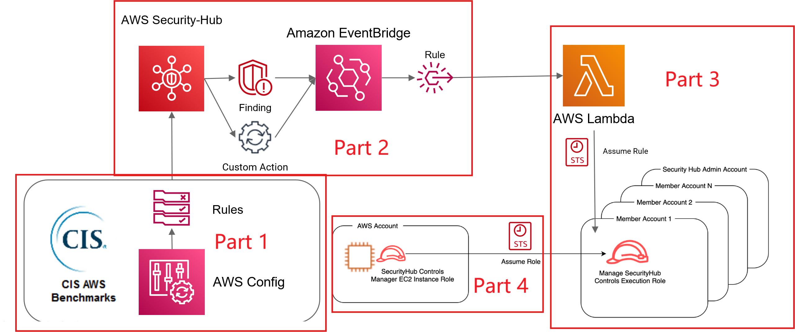

## 2.1 Non-compliant Resource Detection
In this part AWS Config will undertake the resource detection task.

AWS Config is a service for continuously monitoring and evaluating the configuration of AWS resources. It automatically logs configuration changes and evaluates resources against predefined rules or custom rules the user sets (via AWS Config rules). It detects noncompliance by comparing the current state of the resource with the expected state. In this way, AWS Config ensures that resources comply with organizational standards, governance policies, and security best practices.

AWS Config tends to be triggered in two ways one is that instant detection is triggered when a resource is created or changed. The second is to automatically trigger a check on a resource every 24 hours based on a set rule.

If there are any non-compliant results AWS Config sends the results to Security Hub for integration.

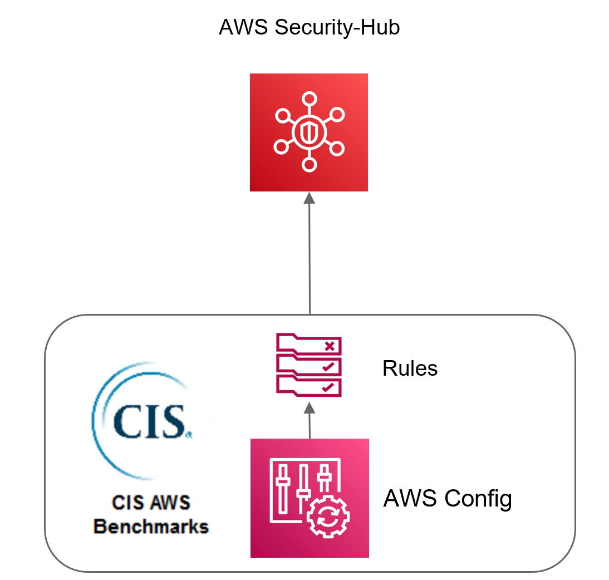

## 2.2 Integration of Detection Results
In this section, the Security Hub will be responsible for integrating discoveries from the AWS Config. Integration here means that the Security Hub receives findings not only from different regions of the account but also from different regions of other accounts in the AWS organization.

To implement this idea, each account in the AWS organization needs to enable Security Hub and send the received findings centrally to an administrative account for processing.

Thanks to the functionality provided by AWS, users can integrate discovery from other accounts by setting one account in the organization as the [Delegated Administrator Account](https://docs.aws.amazon.com/organizations/latest/userguide/orgs_delegate_policies.html) for Security Hub. 

At the same time, the [Central Configuration](https://docs.aws.amazon.com/securityhub/latest/userguide/central-configuration-intro.html) feature provided by the Security Hub of the Delegated Administrator account allows users to turn on the Security Hub of other member accounts at once to perform the detection.

The Security Hub then sends the discovery to the Event Bridge which acts as a bridge to trigger the Lambda Function for subsequent remediation tasks.

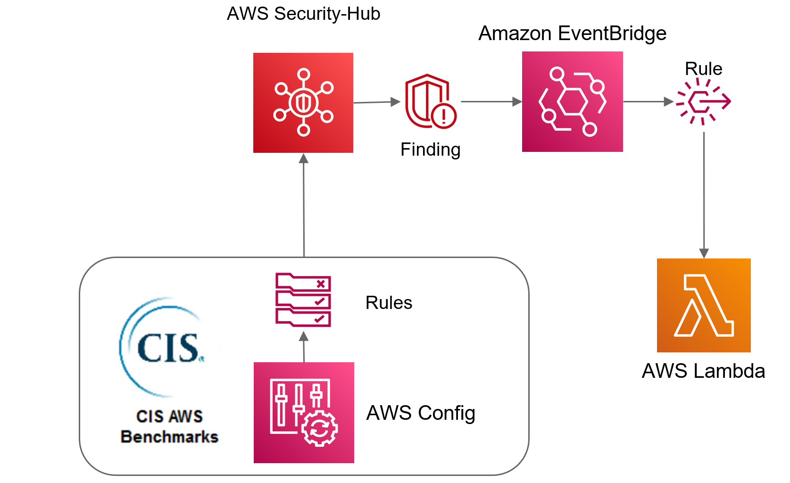


## 2.3 Non-compliant Resource Remediation
In this part, AWS Lambda takes responsibility for remediating non-compliant resources. Since Security Hub findings are integrated into the Delegated Administrator account, users only need to deploy the Lambda function from this account to manage remediation tasks.

AWS Lambda is a serverless computing service that allows users to run code without provisioning or managing servers. It automatically executes code based on triggers, enabling automated resource remediation by integrating Lambda functions with EventBridge. These Lambda functions interact with AWS resources by calling API operations through the AWS SDK.

Each Lambda function is assigned an IAM Role to control access and ensure secure operations. This IAM Role defines a set of permissions through a Policy file, specifying which services and operations the function can access.

For cross-account remediation, member accounts within an AWS organization must be configured with a dedicated IAM Role. This role is responsible for performing remediation tasks specific to each account. A dedicated IAM role in the Delegated Administrator account will also assume this dedicated IAM role.

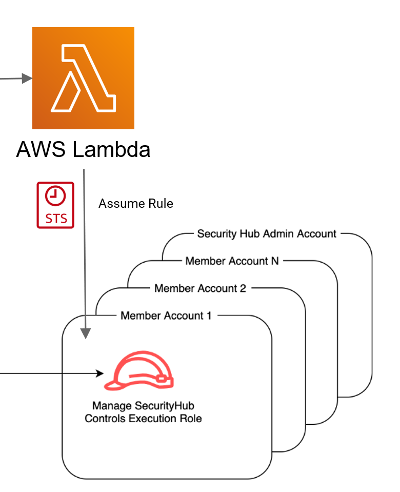

## 2.4 (Optional) Adjustment of Detection Rules
This optional part will allow users to manually enable or disable a particular detection rule in AWS Config for a member account.

The implementation of this part comes mainly from an article called ["Disabling Security Hub controls in a multi-account environment"](https://aws.amazon.com/blogs/security/disabling-security-hub-controls-in-a-multi-account-environment/). See the corresponding [GitHub](https://github.com/aws-samples/aws-security-hub-cross-account-controls-disabler) for details.

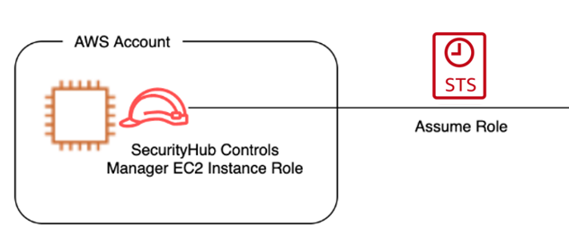

# ⚙️ 3 Required AWS Serivce
1. [AWS Config](https://docs.aws.amazon.com/config/latest/developerguide/WhatIsConfig.html): A service that continuously monitors and evaluates the configuration of AWS resources against predefined or custom compliance rules.

2. [AWS Security Hub](https://docs.aws.amazon.com/securityhub/latest/userguide/what-is-securityhub.html): A centralized service that provides comprehensive security visibility, consolidating findings from multiple AWS services and third-party tools.

3. [AWS Lambda Function](https://docs.aws.amazon.com/lambda/latest/dg/welcome.html): A serverless computing service that runs code in response to events, enabling automated workflows and resource remediation.

4. [Amazon EventBridge](https://docs.aws.amazon.com/eventbridge/latest/userguide/eb-what-is.html): A serverless event bus that connects application events across AWS services and custom applications for automated workflows.

5. [Amazon Simple Notification Service (SNS)](https://docs.aws.amazon.com/sns/latest/dg/welcome.html): A fully managed messaging service for sending notifications to subscribers via multiple delivery methods like email or SMS.

6. [AWS CloudFormation](https://docs.aws.amazon.com/cloudformation/): A service that simplifies infrastructure management by allowing users to define, provision, and manage AWS resources using declarative code templates, ensuring consistent and repeatable deployments.

# 🛠️ 4 Environment Setup
This section explains how to deploy an automated remediation solution within an AWS Organization using the management account.

### **🚨 Note:**
*Any platform code deployed at the organization level will not be applied to the management account.
This aligns with the principle of least privilege for the management account, meaning users should avoid setting up resources or configurations directly on the management account.
This approach enhances the security of the management account by reducing its exposure and ensuring it does not require security checks for managed resources.*

## 4.1 CloudFormation Stacksets Deployment - Organization Level
In this part, we will introduce three CloudFormation templates for deploying AWS resources at the organizational level.

These templates will be deployed to each member account through the admin account to ensure that a corresponding AWS resource is created in each member account.

Part 1. AWS Config Deployment
Part 2. Remediation Role Deployment
Part 3. SNS Notification Deployment

### 4.1.1 AWS Config Deployment
Since AWS Config is a regional resource, users in the corresponding region of their member accounts need to manually turn it on and set up the corresponding rules. Therefore, implementing this is not practical in large organizations.

The remediation solution provides a CloudFormation template called [Auto_AWS_Config_Deployment](./CloudFormation_Depolyment/Auto_AWS_Config_Deployment.yml) to automatically enable AWS Config in all member accounts for the corresponding region.

1. Upload the template in your management account by following the order of the following options `CloudFormation > StackSets > Create StackSet`

2. After a successful upload, users will be directed to the parameter settings page. This template already includes all the required parameters needed to enable the AWS Config service.

All parameters have been pre-configured with default values; however, users can modify these values to meet specific requirements. Each parameter includes a brief description to help users understand its purpose.

Special attention should be given to two parameters: Record global resource types and Record selected resource types.

When configuring these parameters, users should ensure that the Record selected resource types option is set to False. Since AWS Config is a regional service, enabling this option would result in global resources being redundantly recorded in every region where AWS Config is enabled. This would lead to unnecessary duplicate detections and increased costs.

The Record selected resource types option should only be enabled when neither of the first two options for recording resources is being utilized.

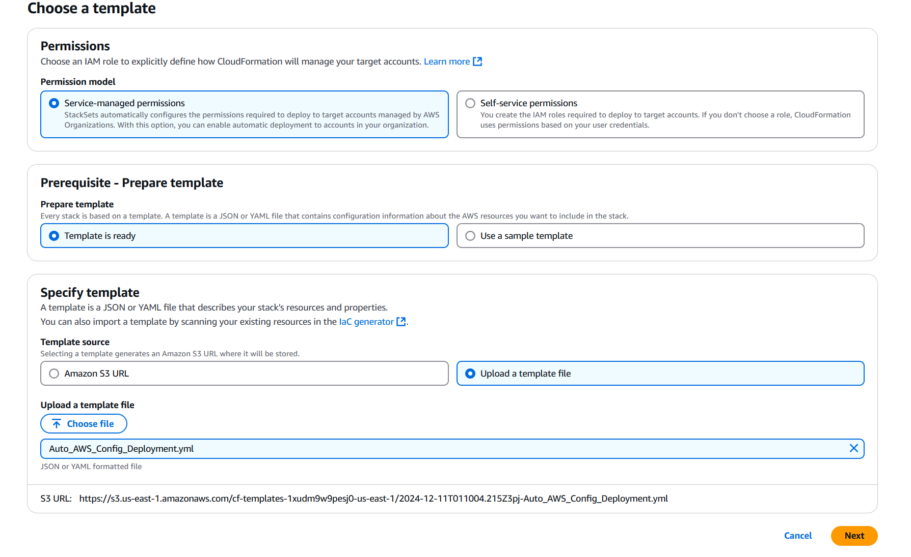

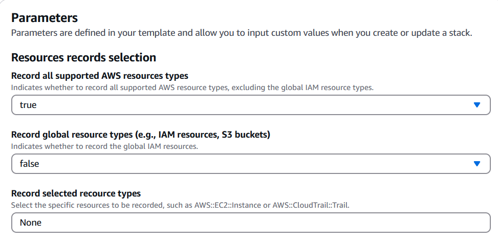

### **🚨 Note:**
*If global resources need to be logged, users only need to enable AWS Config's global resource logging feature in one of the member accounts' regions. To fulfill this requirement users should run the template twice. The first time set up only one region and select Record Global Resources. The second time set up a region other than the previous region and do not record global resources.*

3. For the `Specify regions` option select regions to enable AWS Config.

4. Set the `Deployment targets` to `Deploy to organization` to ensure that this setting is deployed to all member accounts.

5. Set `Automatic deployment` to `Activated` in the `Auto-deployment options` to ensure that new member accounts joining the organization are also automatically enabled for AWS Config.

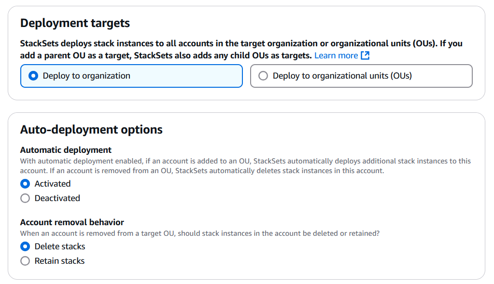

6. After successful setup, users can check in Stack instances to see if AWS Config has been successfully turned on in the selected region for each account.

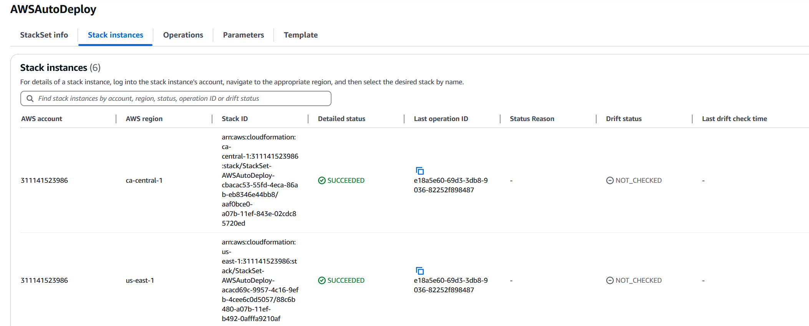

### 4.1.2 Remediation Role Deployment
IAM Role being a global resource, users need to set up this role manually in each member account. Therefore, it is not practical to implement this feature in large organizations.

The remediation solution provides an application called [Auto_Remediator_Role_Deployment](./CloudFormation_Depolyment/Auto_Remediator_Role_Deployment.yml) CloudFormation template to automatically create the IAM Role for remediation measures in all member accounts.

1. Upload the template in your management account by following the order of the following options `CloudFormation > StackSets > Create StackSet`

2. After a successful upload, users will be directed to the parameter settings page. This template already includes all the required parameters needed to create a IAM Role.

3. Fill the first parameter with the ARN of the IAM Role that will be used to execute the Lambda Function so that the Security Hub's Delegated Administrator Account can assume the CIS_Remediator_Role of the member account.

### **🚨 Note:**
*It is recommended that users do not change the name of the role as it is used by default in the Lambda Function.*

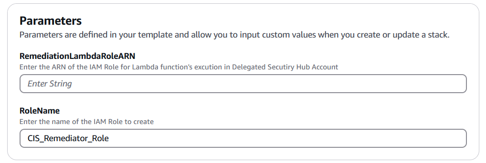

4. For the `Specify regions` option make sure to select only one region to create.

Since IAM roles are global resources selecting multiple regions will result in duplicate creation and thus conflicts.

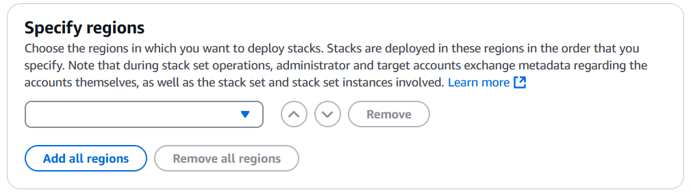

5. After successful setup, users can check in Stack instances to see if IAM role has been successfully created in the selected region for each account.

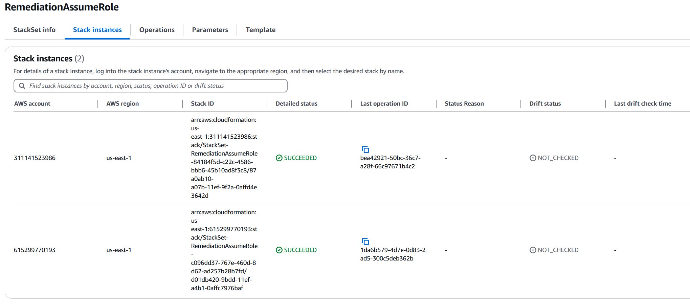

### 4.1.3 SNS Notification Deployment
Since SNS Notification is a regional resource, users in the region corresponding to its member accounts need to open it manually and set up email addresses. Therefore, it is not practical to implement this feature in large organizations.

The remediation solution provides an application called [Auto_SNS_Notification_Deployment] (. /CloudFormation_Depolyment/Auto_SNS_Notification_Deployment.yml) CloudFormation template to automatically enable SNS Notification in all member accounts of the corresponding region.

1. Upload the template in your management account by following the order of the following options `CloudFormation > StackSets > Create StackSet`

2. After a successful upload, users will be directed to the parameter settings page. This template already includes all the required parameters needed to enable the SNS Notification.

3. Fill the email address to receive the notification of remediation result.

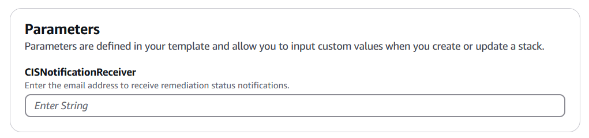

4. For the `Specify regions` option select regions to enable SNS Notification.

5. After successful setup, users can check in Stack instances to see if SNS Notification has been successfully created in the selected region for each account.

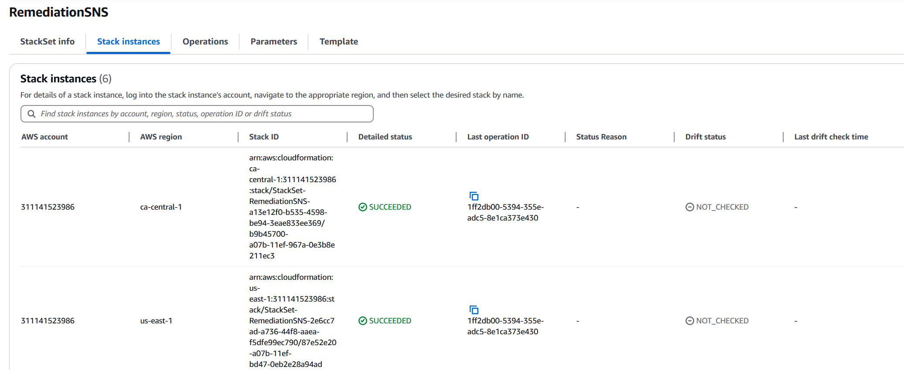

6. Please go to the email address users set to confirm the subcription.

## 4.2 Delegated Administrator Account Set Up - Account Level
In this part users need to make some manual settings for the Delegated Administrator Account of Security Hub. 

The reason for not automating this part of the setup is that users only need to make a few settings for one account.

Part 1. Set the Member Account to be the Delegated Administrator Account for the Security Hub 
Part 2. Set Configuration in the Delegated Administrator Account
Part 3. Set Lambda Function in the Delegated Administrator Account
Part 4. Modify Lambda Function IAM Role Permissions in the Delegated Administrator Account
Part 5. Set the Event Bridge in the Delegated Administrator Account

### 4.2.1 Set the Member Account to be the Delegated Administrator Account for the Security Hub 
1. Users need to enable Security Hub in the management account and then authorize one of the member accounts in the organization as a Delegated Administrator Account.

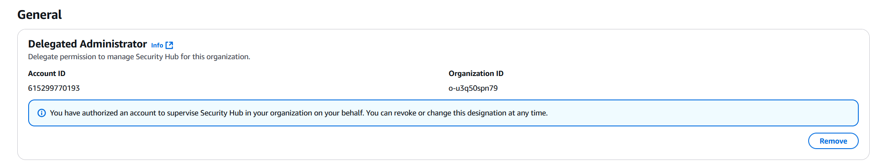

### 4.2.2 Set Configuration in the Delegated Administrator Account
1. Set up Central Configuration in the Delegated Administrator Account to enable Security Hub in all member accounts and use CIS Benchmark V3.0.0 as a benchmark.


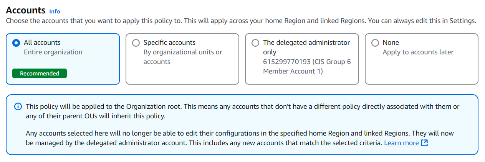

### **🚨 Note:**
*When selecting monitoring areas it is recommended to select only the desired areas. If all areas are selected, additional time may be required to complete the setup.*

### 4.2.3 Set Lambda Function in the Delegated Administrator Account
1. Search for Lambda Function in AWS and set it up in the following order
`Create Function > Function name > Self-defined name > Runtime > python 3.8`

2. Upload the [CISRemediation.zip](./Lambda_Function/CISRemediation.zip) in the Lambda_Function folder that contains all the functions used to automate the fix after the functions have been created.

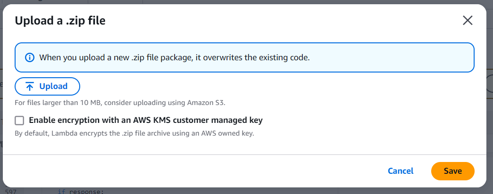

3. Once the code is uploaded, users need to add a Trigger to the Lambda Function and set the Event Bridge as the source so that the findings can trigger the corresponding fix function. 

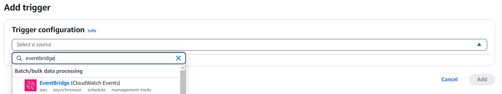
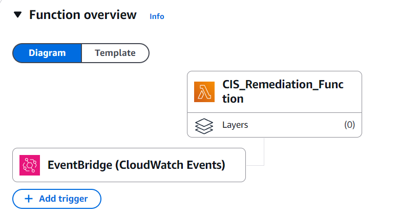

4. Then users need to go to Configuration > General Configuration and set the Timeout as 30 sec. Otherwise some Lambda Functions can not execute in time.

### 4.2.4 Modify Lambda Function IAM Role Permissions in the Delegated Administrator Account
1. After successfully setting up the Lambda Function it automatically creates an IAM Role in the Delegated Administrator Account. Users will need to find this role and set up a separate permission for it in order to assume the Remediation Role in the other member accounts.

2. After finding the corresponding IAM Role follow these steps to add the policy
`Add permissions > Create inline policy > JSON > Copy the policy below > Name the policy as CISRemediation`

3. ```json
   {
	"Version": "2012-10-17",
	"Statement": [
		{
			"Sid": "CrossAccountRemediatorRoleAssumption",
			"Effect": "Allow",
			"Action": "sts:AssumeRole",
			"Resource": "arn:aws:iam::*:role/CIS_Remediator_Role"
		}
   	]
   }

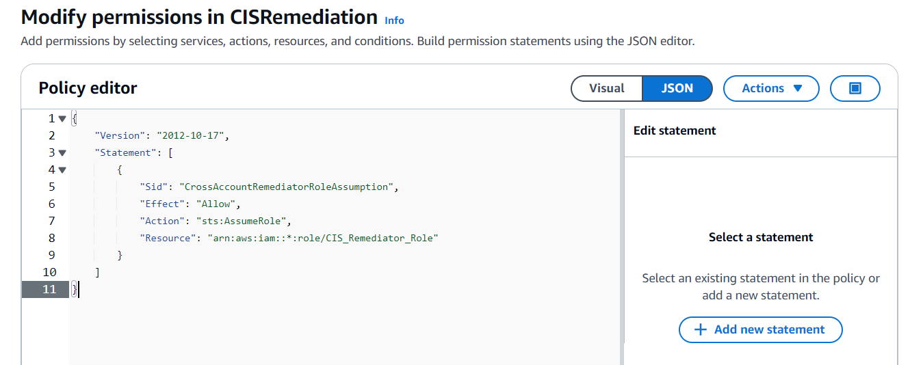

### 4.2.5 Set the Event Bridge in the Delegated Administrator Account for Auto Remediation
1. Search for Event Bridge in AWS and choose `Create rule`.

2. In the `Build event pattern` set the `Event source` to `Other`.

3. In the `Creation method` set it to `Custom pattern`.

4. Copy the rule in [Event_Trigger.jason] in Event_Bridge_Trigger folder into the `Event pattern`.

5. Set the target to the Lambda Function which user created in previous.


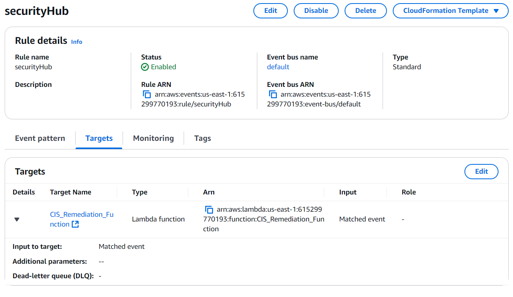

### 4.2.6 Set the Event Bridge in the Delegated Administrator Account for Custom Action
1. Search for Security Hub and set it up.

2. In the `Custom actions` choose to `Create custom action` and copy the `Custom action ARN`.

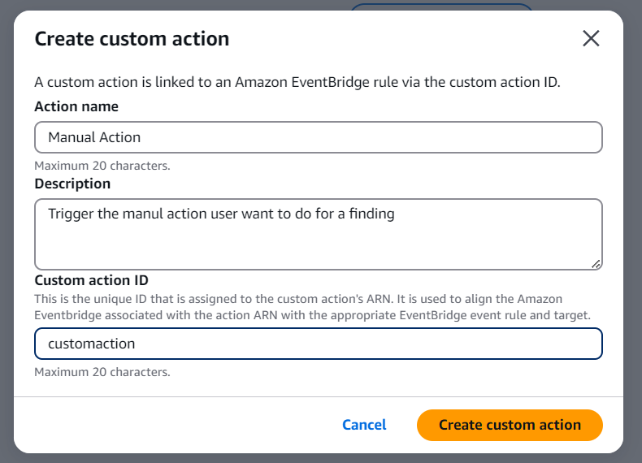
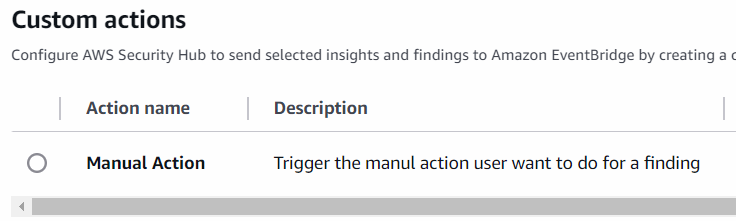

3. Search for Event Bridge in AWS and set it up.

4. In the `Build event pattern` set the `Event source` to `AWS events or EventBridge partner events`.

5. In the `Creation method` set it to `Use pattern form`.

6. Set the `AWS service` to `Security Hub`.

7. Set the `Event type` to `Security Hub Findings - Custom Action`

8. Choose `Specific custom action ARN(s)` and paste the copied ARN.

9. Set the target to the Lambda Function which user created in previous.

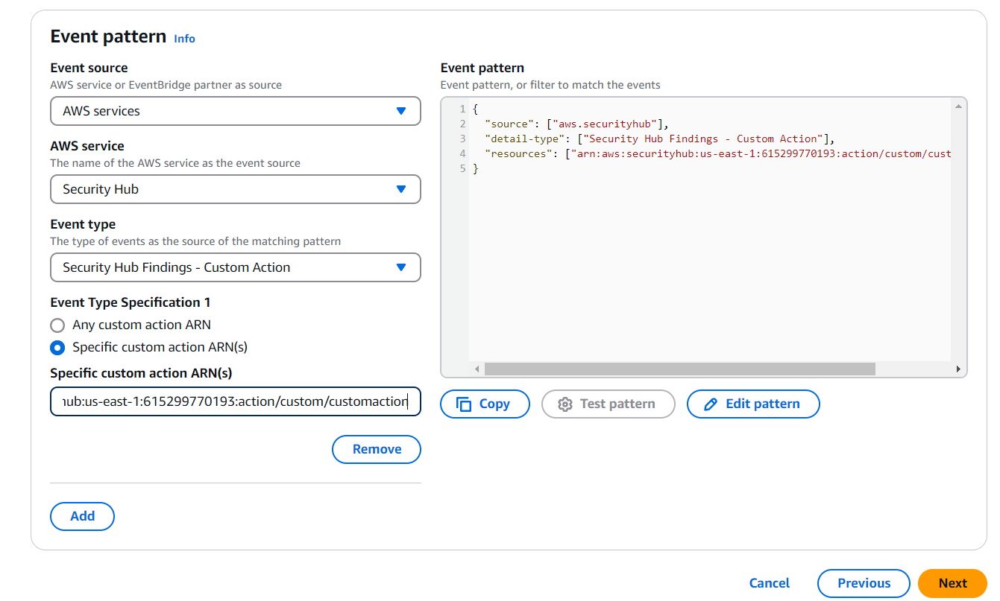
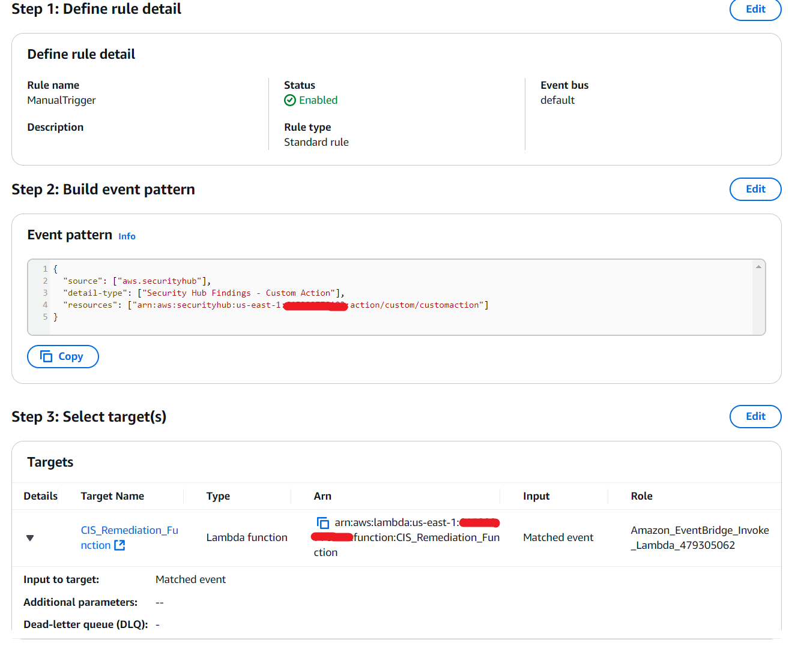

### **🚨 Note:**
*The following deployment method is optional. The user only need to choose one way to deploy.*
## 4.3 AWS Service Catalog Deployment - Organization Level
AWS Service Catalog is designed to help organizations centrally manage and deploy an approved collection of IT services. It allows administrators to create and manage catalogs to deploy AWS resources.

Since AWS Service Catalog also uses the same template code as CloudFormation for product deployment. Therefore, users can also use this service to deploy AWS resources required for automated remediation programs.

Users can package the template code for product deployment in member accounts. Compared to CloudFormation, Sevice Catalog supports version release management, privilege access, and cost management, making it ideal for future updates and maintenance.

Users can easily upgrade the product or roll back to a previous version with versioning.

Privilege control ensures only authorized users or teams can access and use specific products.

Cost management helps users track and optimize resource usage more efficiently.

In addition, Service Catalog's centralized management capabilities support cross-account and multi-region product deployments, enabling organizations to maintain consistency and efficiency in large-scale environments.

### **🚨 Note:**
*All of the template code used in Service Catalog is the same as that used in CloudFormation. Therefore, when using Service Catalog products, please follow the same procedure as before. The section here only provides how to create and share Service Catalog products.*

### 4.3.1 Management Account Set Up

1. Search the Service Catalog in AWS in Management Account.

2. Follow these steps to create a product
`Product list > Create product > CloudFormation > Version details > Use a template file > Upload file` 

Then users need to enter the `Product name` and `Owner`

The `Support details` is optional.  

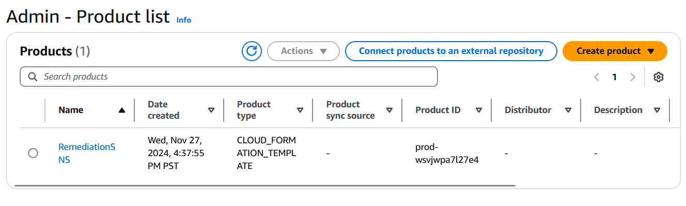


3. Follow these stesp to create portfolios for the products
`Portfolios > Create portfolio > After Creation > Actions > Add product to portfolio > Select the previous created products`

Users can add multiple products into one portfolio.

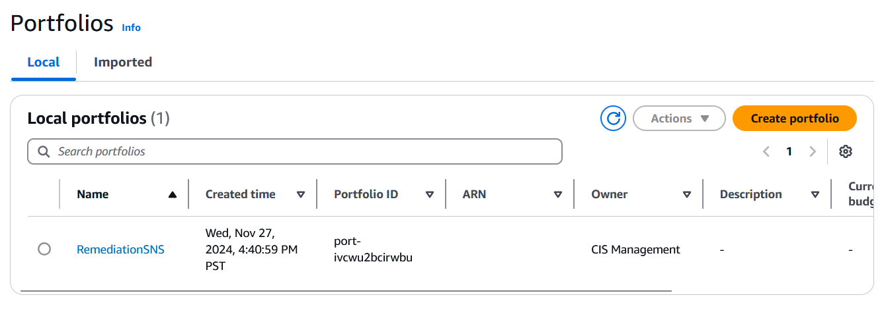

4. In Share tab users need to set how to share the portfolio. (For this product users should choose `AWS Organization`.)

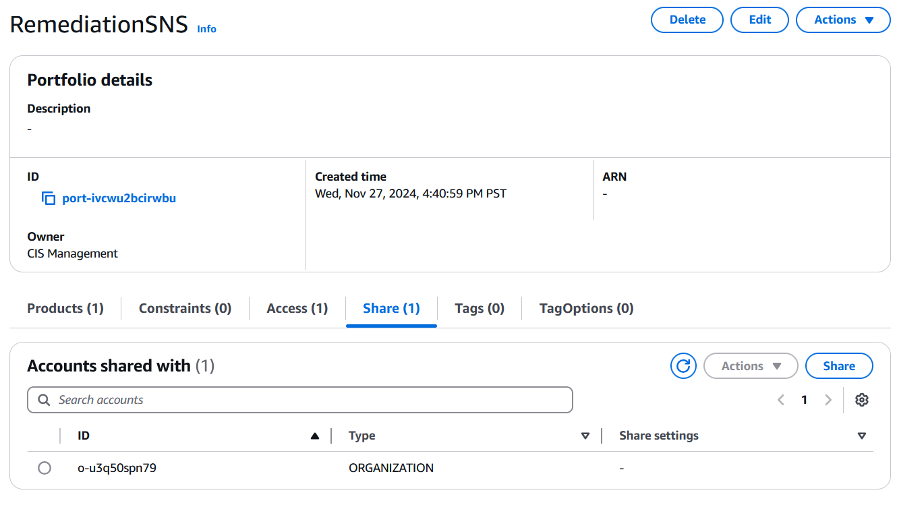

### 4.3.2 Member Account Set Up

1. For member accounts receiving products search Service Catalog in AWS.

2. Follow these steps to receive a portfolio
`Portfolios > Imported > Actions > Import portfolio > Organization > Enter the Portfolio ID of the portfolio created in the Management Account`

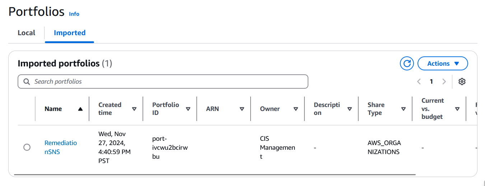

3. In the Access tab choose the IAM User, Group or Role can use this product.

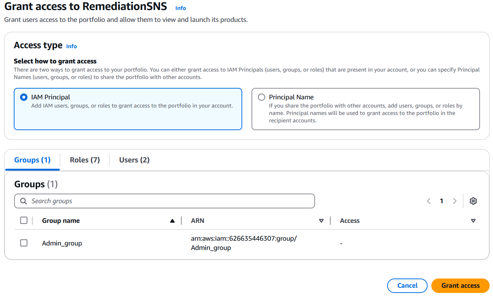

4. Log into the member account by the IAM User which the users have given access.

5. After login user can find the product under `Provisioning > Products`

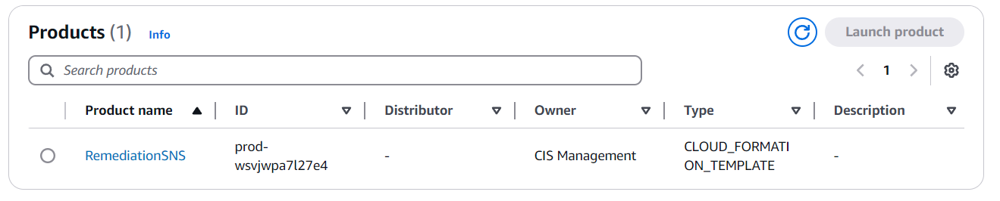

### 4.3.3 Summary
AWS Service Catalog provides more flexible product deployment. Product owners can provide ongoing maintenance for automated remediation programs through version updates. 

At the same time the integration with IAM User better restricts access to the product by other users. 

However, compared to CloudFormation's direct deployment, Service Catalog requires more settings for product usage such as IAM User permissions and product acceptance. 

Therefore, this part is only an innovation of the project and is not mandatory for users.

# 4.4 Optional Requirement
For the creation of optional requirements follow the steps in [GitHub](https://github.com/aws-samples/aws-security-hub-cross-account-controls-disabler).

# 🚑 5 Remediation

Based on Chapter 4 of this report, the environment configuration of our AWS organization is complete. AWS Config will monitor all resources within the organizaion according to the rules defined in the CIS Benchmark. If any non-compliant configurations or potential vulnerabilities are defined, AWS Security Hub will aggregate all security findings. AWS EventBridge will then trigger events, and Lambda functions will act based on the rules set in EventBridge, either notifying users via email or performing automated remediation. 

## 5.1 Lambda functions

After being triggered by an EventBridge event, the Lambda Function will invoke the appropriate remediation functions based on the attributes of the event. The specific mechanism in [lambda_function.py](./Lambda_Function/lambda_function.py) is as follows:

1. Assume a CIS Remediator role, and create a target session using temporary credentials retrieved from the assumed role.
2. Use the SecurityControlId field in the EventBridge event to determine the ID of security issue and match it to the corresponding CIS control.
3. Invoke appropriate remediation functions in the [CISRemediation.py](./Lambda_Function/CISRemediation.py) to remediate the issues.
4. Once the remediation is complete, use SNS resources specific for CIS remediation to notify users via email about the results of the remediation or any further actions required.

## 5.2 CIS control remediations

The functions in CISRemediation.py form the key component of the automated remediation process.

This project is built based on the CIS AWS Foundations Benchmark v3.0.0, which comprises a total of 63 controls. These controls are categorized as follows:

1. 27 controls are not supported by AWS Security Hub and are therefore excluded from our automatic remediation functions.
2. 6 controls are supported by Security Hub but do not require manual remediation by users.
3. 30 controls are supported by Security Hub and can be automatically remediated through Lambda functions.

List of CIS controls supported by AWS Security Hub and comparison of each CIS AWS Foundations Benchmark version:
[CIS AWS Foundations Benchmark](https://docs.aws.amazon.com/securityhub/latest/userguide/cis-aws-foundations-benchmark.html)

### 5.2.1 CIS Controls not supported by Security Hub 

The following are CIS controls that cannot be automatically detected by AWS Security Hub. These controls are not within the scope of our Lambda functions:

| CIS control ID | Control Description | 
|------------------|------------------|
| 1.1    | Maintain current contact details     | 
| 1.2    | Ensure security contact information is registered     |
| 1.3    | Ensure security questions are registered in the AWS account    | 
| 1.7    | Eliminate use of the 'root' user for administrative and daily tasks    | 
| 1.11    | Do not setup access keys during initial user setup for all IAM users that have a console password    | 
| 1.13    | Ensure there is only one active access key available for any single IAM user   | 
| 1.16    | Ensure IAM policies that allow full "*:*" administrative privileges are not attached   | 
| 1.18    | Ensure IAM instance roles are used for AWS resource access from instances   | 
| 1.21    | Ensure IAM users are managed centrally via identity federation or AWS Organizations for multi-account environments   | 
| 2.1.3    | Ensure all data in Amazon S3 has been discovered, classified and secured when required   | 
| 4.1    | Ensure unauthorized API calls are monitored 				   | 
| 4.2    | Ensure management console sign-in without MFA is monitored 				   | 
| 4.3    | Ensure usage of 'root' account is monitored 				   | 
| 4.4    | Ensure IAM policy changes are monitored 				   | 
| 4.5    | Ensure CloudTrail configuration changes are monitored 				   | 
| 4.6    | Ensure AWS Management Console authentication failures are monitored 				   | 
| 4.7    | Ensure disabling or scheduled deletion of customer created CMKs is monitored 				   | 
| 4.8    | Ensure S3 bucket policy changes are monitored 				   | 
| 4.9    | Ensure AWS Config configuration changes are monitored 				   | 
| 4.10    | Ensure security group changes are monitored 				   | 
| 4.11    | Ensure Network Access Control Lists (NACL) changes are monitored				   | 
| 4.12    | Ensure changes to network gateways are monitored 				   | 
| 4.13    | Ensure route table changes are monitored 				   | 
| 4.14    | Ensure VPC changes are monitored 				   | 
| 4.15    | Ensure AWS Organizations changes are monitored 				   | 
| 4.16    | Ensure AWS Security Hub is enabled				   | 
| 5.5    | Ensure routing tables for VPC peering are "least access"   | 


### 5.2.2 CIS Controls need manual remediations

The following controls can be detected by AWS Security Hub but require manual actions from users to complete the remediation process. In case of these controls, our functions are configured to send email notifications, keeping users informed of the findings:

| CIS control ID |AWS Control ID |  Control Description |  Actions Required from Users | 
|------------------|------------------|------------------|------------------|
|1.4|IAM.4|[IAM root user access key should not exist](https://docs.aws.amazon.com/securityhub/latest/userguide/iam-controls.html#iam-4)|Delete the root user access key|
|1.5|IAM.9|[MFA should be enabled for the root user](https://docs.aws.amazon.com/securityhub/latest/userguide/iam-controls.html#iam-9)|Enable MFA for the root user|
|1.6|IAM.6|[Hardware MFA should be enabled for the root user](https://docs.aws.amazon.com/securityhub/latest/userguide/iam-controls.html#iam-6)|Add a hardware MFA device for the root user|
|1.10|IAM.5|[MFA should be enabled for all IAM users that have a console password](https://docs.aws.amazon.com/securityhub/latest/userguide/iam-controls.html#iam-5)|Add MFA for IAM users|
|2.1.2|S3.20|[S3 general purpose buckets should have MFA delete enabled](https://docs.aws.amazon.com/securityhub/latest/userguide/s3-controls.html#s3-20)|Enable S3 MFA delete on a bucket|
|3.3|Config.1|[AWS Config should be enabled and use the service-linked role for resource recording](https://docs.aws.amazon.com/securityhub/latest/userguide/config-controls.html#config-1)|Enable AWS Config and record all required resources|

>Links to the AWS documentation have been provided, where you can find more detailed information about the controls.

### 5.2.3 CIS Controls support automatic remediation

The following controls are fully supported by AWS Security Hub and can be automatically remediated after lambda functions are triggered by EventBridge rules. 

#### 5.2.3.1 IAM controls

| CIS control ID |AWS Control ID |  Control Description |  Remediation Actions | 
|------------------|------------------|------------------|------------------|
|1.8|IAM.15|[Ensure IAM password policy requires minimum password length of 14 or greater](https://docs.aws.amazon.com/securityhub/latest/userguide/iam-controls.html#iam-15)|Change the minimum length of the IAM password policy to 14 or greater.|
|1.9|IAM.16|[Ensure IAM password policy prevents password reuse](https://docs.aws.amazon.com/securityhub/latest/userguide/iam-controls.html#iam-16)|Change the password policy to prevent users from reusing recent passwords.|
|1.12|IAM.22|[IAM user credentials unused for 45 days should be removed](https://docs.aws.amazon.com/securityhub/latest/userguide/iam-controls.html#iam-22)|Delete IAM credentials that have not been used for more than 45 days.|
|1.14|IAM.3|[IAM users' access keys should be rotated every 90 days or less](https://docs.aws.amazon.com/securityhub/latest/userguide/iam-controls.html#iam-3)|Disable IAM access key that has been used for more than 90 days.|
|1.15|IAM.2|[IAM users should not have IAM policies attached](https://docs.aws.amazon.com/securityhub/latest/userguide/iam-controls.html#iam-2)|Create the user group with policy of users then detach the policy of IAM user and move IAM user to user group.|
|1.17|IAM.18|[Ensure a support role has been created to manage incidents with AWS Support](https://docs.aws.amazon.com/securityhub/latest/userguide/iam-controls.html#iam-18)|Create an IAM role named support_role and assign the support access policy.|
|1.19|IAM.26|[Expired SSL/TLS certificates managed in IAM should be removed](https://docs.aws.amazon.com/securityhub/latest/userguide/iam-controls.html#iam-26)|Delete expired SSL/TLS certificates. |
|1.20|IAM.28|[IAM Access Analyzer external access analyzer should be enabled](https://docs.aws.amazon.com/securityhub/latest/userguide/iam-controls.html#iam-28)|Create an IAM Access Analyzer named "ExternalAccessAnalyzer".|
|1.22|IAM.27|[IAM identities should not have the AWSCloudShellFullAccess policy attached](https://docs.aws.amazon.com/securityhub/latest/userguide/iam-controls.html#iam-27)|Remove the AWSCloudShellFullAccess policy from any IAM role, user and group.|

>Links to the AWS documentation have been provided, where you can find more detailed information about the controls.  

>CIS 1.9: "Number of passwords to remember" is set to 24.  

>CIS 1.19: [REASON FOR "CANNOT TEST"].

#### 5.2.3.2 Storage controls

| CIS control ID |AWS Control ID |  Control Description |  Remediation Actions | 
|------------------|------------------|------------------|------------------|
|2.1.1|S3.5|[S3 general purpose buckets should require requests to use SSL](https://docs.aws.amazon.com/securityhub/latest/userguide/s3-controls.html#s3-5)|Add a new policy into S3 bucket policy to deny the HTTP connect of S3 bucket.|
|2.1.4.1|S3.1|[S3 general purpose buckets should have block public access settings enabled](https://docs.aws.amazon.com/securityhub/latest/userguide/s3-controls.html#s3-1)|Set all options in "PublicAccessBlockConfiguration" to true to block public access at account level.|
|2.1.4.2|S3.8|[S3 general purpose buckets should block public access](https://docs.aws.amazon.com/securityhub/latest/userguide/s3-controls.html#s3-8)|Set all options in "PublicAccessBlockConfiguration" to true to block public access at bucket level.|
|2.2.1|EC2.7|[EBS default encryption should be enabled](https://docs.aws.amazon.com/securityhub/latest/userguide/ec2-controls.html#ec2-7)|Enable the EBS default encryption.|
|2.3.1|RDS.3|[RDS DB instances should have encryption at-rest enabled](https://docs.aws.amazon.com/securityhub/latest/userguide/rds-controls.html#rds-3)|Make a backup of RDS DB then encrypt the backup by creating a new KMS key. Delete the previous RDS DB. Create a new RDS DB with same name by using encrypted backup.|
|2.3.2|RDS.13|[RDS automatic minor version upgrades should be enabled](https://docs.aws.amazon.com/securityhub/latest/userguide/rds-controls.html#rds-13)|Enable automatic minor version upgrades for RDS DB.|
|2.3.3|RDS.2|[RDS DB Instances should prohibit public access, as determined by the PubliclyAccessible configuration](https://docs.aws.amazon.com/securityhub/latest/userguide/rds-controls.html#rds-2)|Change PubliclyAccessible flag.|
|2.4.1|EFS.1|[Elastic File System should be configured to encrypt file data at-rest using AWS KMS](https://docs.aws.amazon.com/securityhub/latest/userguide/efs-controls.html#efs-1)|Create new encrypted file system (need manual data migration)|

>Links to the AWS documentation have been provided, where you can find more detailed information about the controls.  

#### 5.2.3.3 Logging controls

| CIS control ID |AWS Control ID |  Control Description |  Remediation Actions | 
|------------------|------------------|------------------|------------------|
|3.1|CloudTrail.1|[CloudTrail should be enabled and configured with at least one multi-Region trail that includes read and write management events](https://docs.aws.amazon.com/securityhub/latest/userguide/cloudtrail-controls.html#cloudtrail-1)|Create a multi-region CloudTrail.|
|3.2|CloudTrail.4|[CloudTrail log file validation should be enabled](https://docs.aws.amazon.com/securityhub/latest/userguide/cloudtrail-controls.html#cloudtrail-4)|Enable CloudTrail log file validation|
|3.4|CloudTrail.7|[Ensure S3 bucket access logging is enabled on the CloudTrail S3 bucket](https://docs.aws.amazon.com/securityhub/latest/userguide/cloudtrail-controls.html#cloudtrail-7)|Create a new S3 bucket named "accesslogbucket" for log and enable access logging for CloudTrail's storage S3 buckets.|
|3.5|CloudTrail.2|[CloudTrail should have encryption at-rest enabled](https://docs.aws.amazon.com/securityhub/latest/userguide/cloudtrail-controls.html#cloudtrail-2)|Enable KMS encryption for CloudTrail by creating a new KMS key.|
|3.6|KMS.4|[AWS KMS key rotation should be enabled](https://docs.aws.amazon.com/securityhub/latest/userguide/kms-controls.html#kms-4)|Enable KMS key rotation.|
|3.7|EC2.6|[VPC flow logging should be enabled in all VPCs](https://docs.aws.amazon.com/securityhub/latest/userguide/ec2-controls.html#ec2-6)|Create an IAM role named "CIS-Remediations-VPC-Log-Role" for CloudWatch then create a CloudWatch log group to store VPC flow logs.|
|3.8|S3.22|[S3 general purpose buckets should log object-level write events](https://docs.aws.amazon.com/securityhub/latest/userguide/s3-controls.html#s3-22)|Create a S3 bucket to store logs and configure CloudTrail named "cloudtrailforlogwrite" to log object-level write operations.|
|3.9|S3.23|[S3 general purpose buckets should log object-level read events](https://docs.aws.amazon.com/securityhub/latest/userguide/s3-controls.html#s3-23)|Create a S3 bucket to store logs and configure CloudTrail named "cloudtrailforlogread" to log object-level write operations.|

>Links to the AWS documentation have been provided, where you can find more detailed information about the controls.  

#### 5.2.3.4 Networking controls

| CIS control ID |AWS Control ID |  Control Description |  Remediation Actions | 
|------------------|------------------|------------------|------------------|
|5.1|EC2.21|[Network ACLs should not allow ingress from 0.0.0.0/0 to port 22 or port 3389](https://docs.aws.amazon.com/securityhub/latest/userguide/ec2-controls.html#ec2-21)|Remove the network ACL entry that allows all IPs (0.0.0.0/0) to access ports 22 and 3389.|
|5.2|EC2.53|[EC2 security groups should not allow ingress from 0.0.0.0/0 to remote server administration ports](https://docs.aws.amazon.com/securityhub/latest/userguide/ec2-controls.html#ec2-53)|Remove the security group rule that allows all IPs (0.0.0.0/0) to access the management port.|
|5.3|EC2.54|[EC2 security groups should not allow ingress from ::/0 to remote server administration ports](https://docs.aws.amazon.com/securityhub/latest/userguide/ec2-controls.html#ec2-54)|Remove the security group rule that allows all IPs (::/0) to access the management port.|
|5.4|EC2.2|[VPC default security groups should not allow inbound or outbound traffic](https://docs.aws.amazon.com/securityhub/latest/userguide/ec2-controls.html#ec2-2)|Create a new non-default security group and copy the rules of the default security group. Then remove all inbound and outbound traffic from the default security group.|
|5.6|EC2.8|[EC2 instances should use Instance Metadata Service Version 2 (IMDSv2)](https://docs.aws.amazon.com/securityhub/latest/userguide/ec2-controls.html#ec2-8)|Enable EC2 instances to be updated to use IMDSv2.|

>Links to the AWS documentation have been provided, where you can find more detailed information about the controls. 

# 🧩 6 Remediation example

## 6.1 Automatic remediation

>Take CIS 2.3.1 RDS DB instances should have encryption at-rest enabled as an example. 

	AWS Config rule: Checks if Amazon Relational Database Service (Amazon RDS) DB snapshots are encrypted. The rule is NON_COMPLIANT if the Amazon RDS DB snapshots are not encrypted.
	Remediation: Make a backup of RDS DB then encrypt the backup by creating a new KMS key. Delete the previous RDS DB. Create a new RDS DB with the same name by using the encrypted backup.

### a) AWS Config and Security Hub

Database with non-compliant rules (Encrytion is set to 'Not enabled'):  
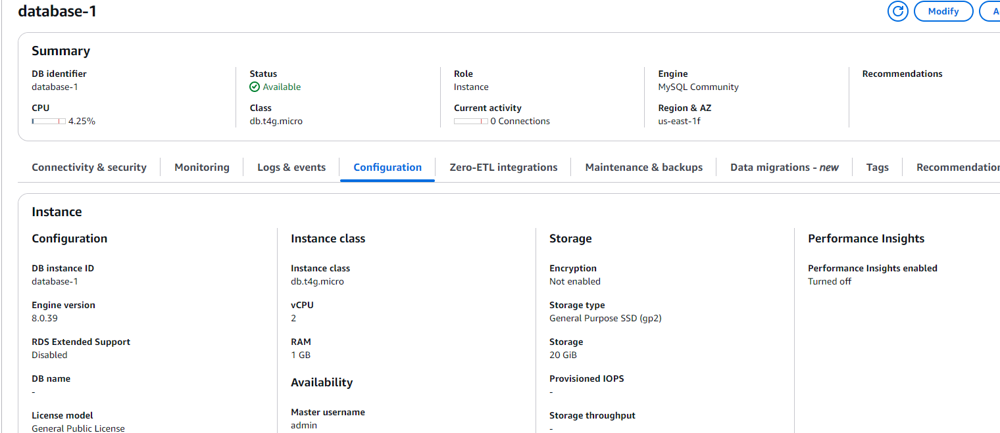

AWS Config:
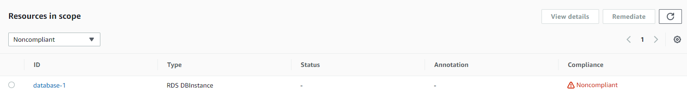

Security Hub:  
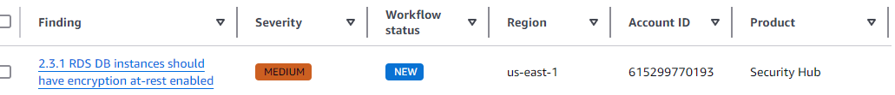


### b) Lambda Functions triggered

The Lambda functions were triggered, initiating the remediation process.
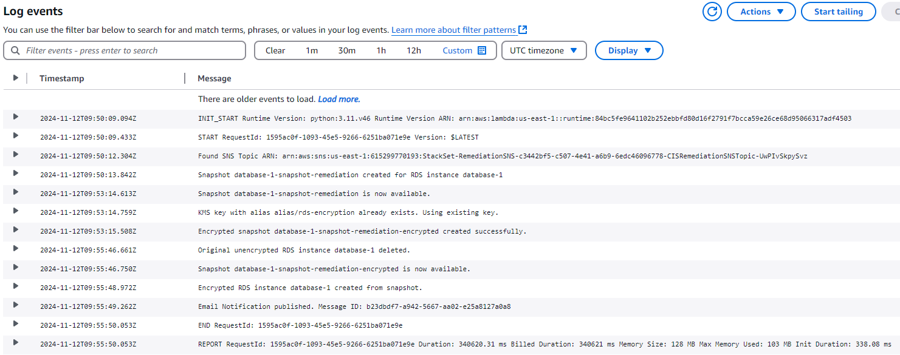

### c) Remediation result

As shown in the CloudWatch Logs:

1. A snapshot was created for the non-compliant database database-1, and the original unencrypted database was deleted.
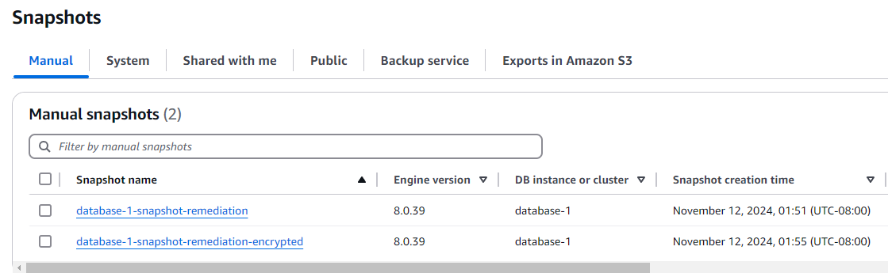
2. A new encrypted database database-1 was created using the snapshot of the original database. The new database is encrypted with a newly generated KMS key.
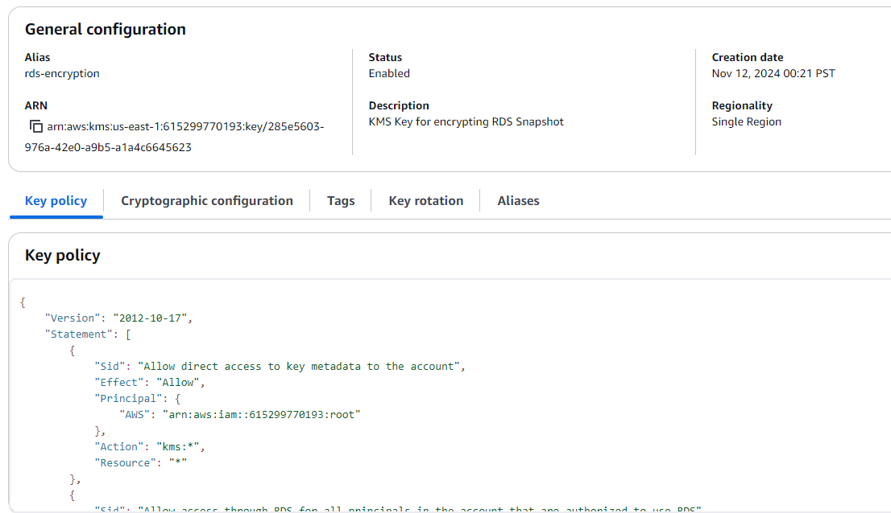
3. An email notification was sent to the user.
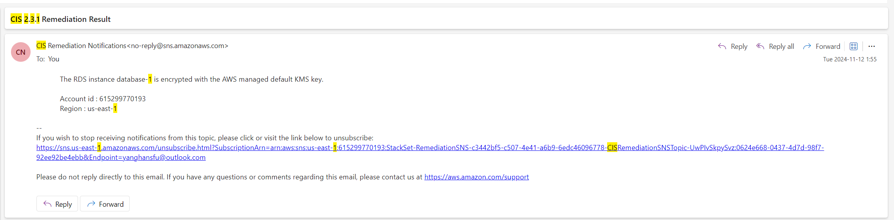


# 🔚 7 Conclusion

In this project, we exploited key AWS services, including CloudFormation, AWS Config, Security Hub, EventBridge and Lambda Functions, to build a robust solution for monitoring and remediation. This integration ensures security compliance across multiple accounts within an AWS organization. 

## key Highlights

	- Deployment: Use CloudFormation for deploying AWS resources at the organizational level.
	- Real-time Resource Monitoring: AWS Config monitors recource configurations and compliance with CIS benchmarks.  
	- Automatic Remediation: Event-driven automation using Lambda Functions enables fast and consistent remedaition of non-compliant resources, reducing labor cost and human error.   
	- Deployment using Service Catalog：​Use AWS Service Catalog to package the template code, which  supports version release management, privilege access, and cost management.

## Disclaimer

All functions included in this project have been thoroughly tested, except for the following two:
- CIS 1.19: The remediation function for this control is not tested because all AWS regions currently support ACM. Since IAM is typically used for managing SSL/TLS certificates only in regions where ACM is unavailable, there are no test scenarios in our test AWS organization.
- CIS 3.3: In our test environments, AWS Config is already enabled across all regions and the remediation function cannot be triggered without the AWS Congfig based on our existing deployment.

Before implementing this solution in your environment, please ensure that you thoroughly review the entire documentation and follow the deployment steps as outlined. Use this project at your own discretion and risk.

## Acknowledgements

I would like to express our gratitude to our mentor and the other contributor of this project for their valuable insights, support and encouragement throughout this project, as well as to our TA for his guidance.

- Mentor:
	- [Mohammad Reza Bagheri](https://github.com/BagheriReza)	 
- Other Contributor:
	- [Yarui Qiu](https://github.com/LottieQ)
- TA:
	- [Prasanna Aravindan](https://github.com/prasanna7401)
